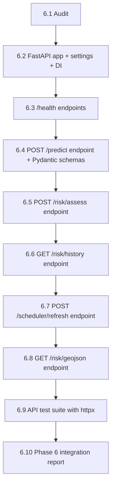

# Phase 6.1 — Codebase Audit & FastAPI Integration Blueprint
## Landslide Early Warning System

**Audit Date:** 2026-10-01  
**Auditor:** Lead Systems Architect  
**Environment:** Python 3.14.0 · pytest 9.1.1 · Windows 10

---

## 1. Executive Summary & Test Baseline Status

### Pre-Audit Test Verification

```
$ python -m pytest tests/ -q --tb=no
.......................................................................
.......................................................................
.......................................................................
.......................................................................
.........................................................
345 passed in 6.98s
```

> **Baseline: 345 / 345 PASSING — 0 failures.** No existing tests were broken before audit.

> [!NOTE]
> 345 tests = 316 Phase 5 tests + 29 Phase 1–4 tests (`test_predict.py`).

### Scope of Phase 6

Phase 6 will expose the fully-verified Phase 4+5 pipeline through:

1. **FastAPI REST API** — typed endpoints for ML prediction, dynamic risk, scheduler control, and historical queries
2. **Pydantic request/response schemas** — wrapping existing dataclasses without duplicating logic
3. **PostgresRiskStore** (optional) — a concrete `RiskStore` subclass for PostGIS, drop-in with the existing ABC
4. **API test suite** — `httpx`-based integration tests, zero live GEE calls

**What Phase 6 will NOT do:**
- Duplicate any Phase 4/5 orchestration logic (all risk logic stays in `src/risk/`)
- Modify existing dataclasses or YAML configs
- Break any existing 345 tests

---

## 2. Phase 4 ML Model Contract

### 2.1 Model Artifacts

| Artifact | Path | Format | Size |
|---------|------|--------|------|
| **Champion model** | `models/xgboost_landslide.joblib` | XGBoost via joblib | 378 KB |
| Alias (same file) | `models/landslide_susceptibility_model.joblib` | joblib | 378 KB |
| Random Forest (baseline) | `models/random_forest_landslide.joblib` | joblib | 5.1 MB |
| Logistic Regression | `models/baseline_logistic_regression.joblib` | joblib | ~2 KB |
| Model metadata | `models/model_metadata.json` | JSON | 1.4 KB |
| Feature schema | `data/processed/feature_columns.json` | JSON | 342 B |
| Susceptibility config | `config/susceptibility_config.json` | JSON | 217 B |

### 2.2 `LandslidePredictor` Interface

**File:** [`src/ml/predict.py`](file:///c:/Users/MAGIZHAN/Desktop/SPEC/Landslide%20Project/landslide_system/src/ml/predict.py)

```python
class LandslidePredictor:
    DEFAULT_MODEL_PATH   = 'models/xgboost_landslide.joblib'
    DEFAULT_META_PATH    = 'data/processed/feature_columns.json'
    DEFAULT_CONFIG_PATH  = 'config/susceptibility_config.json'

    def predict(self, data: dict | pd.DataFrame) -> dict | list[dict]:
        # Single dict → single dict output
        # DataFrame → list of dicts
```

### 2.3 Feature Schema Table

| Feature | Type | Domain | Source | Notes |
|---------|------|--------|--------|-------|
| `slope` | `float` | degrees, ≥ 0 | GIS raster (slope.tif) | Terrain steepness |
| `root_cohesion` | `float` | kPa, > 0 | GIS raster (root_cohesion.tif) | Vegetation root reinforcement |
| `elevation` | `float` | metres | GIS raster (elevation.tif) | NASADEM via GEE |
| `soil_moisture` | `float` | 0.0–1.0 | GLDAS via GEE | Volumetric water content |

> [!IMPORTANT]
> **All 4 features are mandatory.** `LandslidePredictor` raises `ValueError` on missing
> or NaN columns. The API request schema must enforce this at the Pydantic layer.

### 2.4 ML Output Schema

```python
# Single-point output (dict input):
{
    "probability":     float,   # rounded to 4 dp; range [0.0, 1.0]
    "susceptibility":  str      # "Very Low" | "Low" | "Moderate" | "High" | "Very High"
}
```

### 2.5 Susceptibility Classification Thresholds

| Label | Probability Range |
|-------|------------------|
| Very Low | 0.00 – 0.20 |
| Low | 0.21 – 0.40 |
| Moderate | 0.41 – 0.60 |
| High | 0.61 – 0.80 |
| Very High | 0.81 – 1.00 |

### 2.6 Model Performance (from `model_metadata.json`)

| Metric | Validation | Test |
|--------|:---:|:---:|
| Accuracy | 0.8077 | 0.7931 |
| Precision | 0.7835 | 0.7644 |
| Recall | **0.8380** | **0.8230** |
| F1 | 0.8098 | 0.7926 |
| ROC-AUC | **0.9001** | 0.8775 |
| PR-AUC | 0.8902 | 0.8595 |

---

## 3. Phase 5 Risk Engine — Data Schemas & Class Reference

### 3.1 Class Inventory

| Class | File | Phase | Role |
|-------|------|-------|------|
| `ChirpsClient` | `src/risk/chirps_client.py` | 5.2 | GEE CHIRPS data fetcher |
| `RainfallService` | `src/risk/rainfall_service.py` | 5.3 | Domain service layer over ChirpsClient |
| `RainfallFeatureCalculator` | `src/risk/rainfall_features.py` | 5.4 | Cumulative/intensity/API feature engineering |
| `RainfallTriggerEngine` | `src/risk/rainfall_trigger.py` | 5.5 | YAML-driven threshold → trigger state |
| `DynamicRiskEngine` | `src/risk/risk_engine.py` | 5.6 | 2D matrix: susceptibility × trigger → risk |
| `classify_risk()` | `src/risk/risk_levels.py` | 5.7 | Canonical 4-tier classification |
| `RiskScheduler` | `src/risk/risk_scheduler.py` | 5.8 | End-to-end pipeline orchestrator |
| `RiskStore` (ABC) | `src/risk/risk_store.py` | 5.9 | Storage repository interface |
| `SQLiteRiskStore` | `src/risk/risk_store.py` | 5.9 | SQLite concrete implementation |
| `run_assessment()` | `src/risk/run_risk_engine.py` | 5.10 | CLI entry-point / importable function |

### 3.2 Data Schema Catalogue

#### `LocationInput` (dataclass)
```python
@dataclass
class LocationInput:
    latitude:    float    # [-90.0, 90.0]
    longitude:   float    # [-180.0, 180.0]
    location_id: Optional[str] = None
```
**Validation:** raises `ValueError` on out-of-range coordinates.

---

#### `DailyRainfallRecord` (dataclass)
```python
@dataclass
class DailyRainfallRecord:
    location_id:  Optional[str]
    latitude:     float
    longitude:    float
    date:         str             # YYYY-MM-DD
    rainfall_mm:  Optional[float] # None = missing; 0.0 = genuine dry day
    source:       str             # e.g. "CHIRPS/DAILY"
    retrieved_at: str             # UTC ISO-8601
```

---

#### `DailyRecord` (dataclass — feature engineering input)
```python
@dataclass
class DailyRecord:
    date:        str
    rainfall_mm: Optional[float]
    is_complete: bool = True
```

---

#### `RainfallFeatureSet` (dataclass)
```python
@dataclass
class RainfallFeatureSet:
    reference_date:  str            # ISO date
    lookback_days:   int            # always 15
    units:           str            # "mm"
    rainfall_1d:     Optional[float]
    rainfall_3d:     Optional[float]
    rainfall_7d:     Optional[float]
    rainfall_15d:    Optional[float]
    max_daily_rainfall_3d:           Optional[float]
    max_daily_rainfall_7d:           Optional[float]
    max_daily_rainfall_15d:          Optional[float]
    antecedent_precipitation_index:  Optional[float]
    api_decay_k:         float
    is_complete:         bool
    partial_day_flag:    bool
    missing_days_count:  int
```

---

#### `TriggerResult` (dataclass — from `rainfall_trigger.py`)
```python
@dataclass
class TriggerResult:
    trigger_state:   str       # "NORMAL" | "WATCH" | "WARNING" | "CRITICAL"
    trigger_score:   int       # 0 | 1 | 2 | 3
    trigger_reasons: List[str]
```

---

#### `DynamicRiskAssessment` (dataclass)
```python
@dataclass
class DynamicRiskAssessment:
    latitude:                  float
    longitude:                 float
    susceptibility_probability: float    # [0.0, 1.0], 4 dp
    susceptibility_class:      str       # VERY_LOW … VERY_HIGH
    rainfall_trigger_state:    str       # NORMAL … CRITICAL
    rainfall_trigger_score:    int       # 0–3
    final_risk_level:          str       # MINIMAL | LOW | MODERATE | HIGH | SEVERE
    reasons:                   List[str]
    timestamp:                 str       # UTC ISO-8601
```

---

#### `LocationRiskState` (dataclass — scheduler output)
```python
@dataclass
class LocationRiskState:
    location_id:      Optional[str]
    latitude:         float
    longitude:        float
    last_updated:     Optional[str]   # UTC ISO-8601
    observation_date: Optional[str]   # YYYY-MM-DD
    data_age_days:    Optional[float]
    stale:            bool = False
    error_reason:     Optional[str] = None
    risk_payload:     Optional[Dict[str, Any]] = None  # nested DynamicRiskAssessment + canon
```

---

#### `RiskLevel` (dataclass — canonical classification)
```python
@dataclass
class RiskLevel:
    level_enum:        RiskLevelEnum   # LOW | MODERATE | HIGH | CRITICAL
    numeric_code:      int             # 1–4
    machine_name:      str             # "RISK_LOW" … "RISK_CRITICAL"
    human_description: str
    color_hex:         str             # "#28a745" … "#dc3545"
    ui_severity:       str             # SUCCESS | WARNING | DANGER | CRITICAL
    min_score:         float
    max_score:         float
```

### 3.3 Phase 5 Valid Domain Values

| Domain | Valid Values |
|--------|-------------|
| Susceptibility class | `VERY_LOW`, `LOW`, `MODERATE`, `HIGH`, `VERY_HIGH` |
| Trigger state | `NORMAL`, `WATCH`, `WARNING`, `CRITICAL` |
| Matrix risk level | `MINIMAL`, `LOW`, `MODERATE`, `HIGH`, `SEVERE` |
| Canonical risk level | `LOW`, `MODERATE`, `HIGH`, `CRITICAL` |
| String → canonical mappings | `MINIMAL`→`LOW`, `LOW`→`LOW`, `MODERATE`→`MODERATE`, `HIGH`→`HIGH`, `SEVERE`→`CRITICAL` |

---

## 4. Storage Repository Audit

### 4.1 `RiskStore` ABC Interface

```python
class RiskStore(ABC):
    @abstractmethod
    def save_risk_result(self, result_dict: dict) -> None: ...

    @abstractmethod
    def get_latest_risk(self, location_id: str) -> Optional[dict]: ...

    @abstractmethod
    def get_risk_history(self, location_id: str, limit: int = 30) -> List[dict]: ...

    @abstractmethod
    def get_last_successful_update(self, location_id: str) -> Optional[datetime]: ...

    @abstractmethod
    def mark_stale(self, location_id: str, error_reason: str) -> None: ...
```

### 4.2 `SQLiteRiskStore` — Current Concrete Implementation

| Property | Value |
|---------|-------|
| Backend | Python `sqlite3` (stdlib only) |
| Strategy | Append-only log (no UPDATE — full audit trail) |
| Table | `risk_history` |
| Index | `(location_id, timestamp DESC)` |
| In-memory mode | `db_path=":memory:"` supported (used in all tests) |
| Thread safety | `check_same_thread=False` — safe for single-threaded use |
| JSON serialisation | Complex nested fields stored as JSON strings |

### 4.3 `risk_history` Table Schema

| Column | SQLite Type | Notes |
|--------|------------|-------|
| `id` | `INTEGER PK AUTOINCREMENT` | Auto-assigned |
| `location_id` | `TEXT NOT NULL` | Indexed |
| `latitude` | `REAL` | WGS84 |
| `longitude` | `REAL` | WGS84 |
| `timestamp` | `TEXT NOT NULL` | UTC ISO-8601, indexed |
| `observation_date` | `TEXT` | YYYY-MM-DD |
| `susceptibility_probability` | `REAL` | [0.0, 1.0] |
| `susceptibility_class` | `TEXT` | VERY_LOW…VERY_HIGH |
| `rainfall_1d` | `REAL` | mm |
| `rainfall_3d` | `REAL` | mm |
| `rainfall_7d` | `REAL` | mm |
| `rainfall_15d` | `REAL` | mm |
| `rainfall_trigger_score` | `INTEGER` | 0–3 |
| `rainfall_trigger_state` | `TEXT` | NORMAL…CRITICAL |
| `dynamic_risk` | `TEXT` | MINIMAL…SEVERE |
| `risk_level` | `TEXT` | RISK_LOW…RISK_CRITICAL |
| `data_source` | `TEXT` | "CHIRPS/GEE" or "MOCK/SYNTHETIC" |
| `stale` | `INTEGER DEFAULT 0` | 0=fresh, 1=stale |
| `error_info` | `TEXT` | Error message if stale |

### 4.4 PostgreSQL/PostGIS Readiness Assessment

| Area | Current Status | Action for Phase 6 |
|------|---------------|-------------------|
| Database dependencies | None — stdlib sqlite3 only | Add `psycopg2-binary` or `asyncpg` to requirements |
| SQLAlchemy | **Not present** | Add optionally; or write raw psycopg2 SQL matching current schema |
| PostGIS extension | Not configured | Add `geometry(POINT, 4326)` column to `risk_history` |
| Connection settings | Only `EE_PROJECT_ID` in `.env` | Add `DATABASE_URL` to `.env` |
| Migration scripts | None exist | Create `alembic` migrations or raw DDL scripts |
| `RiskStore` swap | **ABC is ready** | Implement `PostgresRiskStore(RiskStore)` matching the 5-method interface |

> [!TIP]
> The `PostgresRiskStore` swap requires **zero changes** to `RiskScheduler`, `DynamicRiskEngine`,
> or any Phase 5 code — the ABC enforces the interface contract.

---

## 5. Proposed FastAPI Architecture

### 5.1 Module Layout

```
landslide_system/
├── src/
│   ├── api/                       ← NEW in Phase 6
│   │   ├── __init__.py
│   │   ├── main.py                ← FastAPI app factory, lifespan
│   │   ├── dependencies.py        ← get_predictor(), get_store(), get_scheduler()
│   │   ├── schemas/
│   │   │   ├── __init__.py
│   │   │   ├── ml_schemas.py      ← Pydantic request/response for /predict
│   │   │   ├── risk_schemas.py    ← Pydantic for /risk, /history
│   │   │   └── geo_schemas.py     ← GeoJSON FeatureCollection output
│   │   └── routers/
│   │       ├── __init__.py
│   │       ├── health.py          ← GET /health, GET /health/model
│   │       ├── predict.py         ← POST /api/v1/predict
│   │       ├── risk.py            ← POST /api/v1/risk/assess
│   │       ├── history.py         ← GET /api/v1/risk/history/{location_id}
│   │       ├── scheduler.py       ← POST /api/v1/scheduler/refresh
│   │       └── geojson.py         ← GET /api/v1/risk/geojson
│   ├── risk/                      ← UNCHANGED (Phase 5)
│   └── ml/                        ← UNCHANGED (Phase 4)
├── tests/
│   ├── api/                       ← NEW in Phase 6
│   │   ├── test_health.py
│   │   ├── test_predict_endpoint.py
│   │   ├── test_risk_endpoint.py
│   │   ├── test_history_endpoint.py
│   │   ├── test_scheduler_endpoint.py
│   │   └── test_geojson_endpoint.py
│   └── ... (existing 345 tests — untouched)
├── config/                        ← UNCHANGED
└── .env                           ← Extend with API_HOST, API_PORT, DATABASE_URL
```

### 5.2 Pydantic Schema Mapping Strategy

The strategy is **wrapping, not duplicating**: Pydantic models at the API boundary handle
HTTP-level validation and serialisation; the underlying dataclasses remain the single source
of truth for business logic.

```
HTTP Request (JSON)
    → Pydantic Request Schema  (validation: types, ranges, required fields)
        → Existing dataclass / service call  (all logic lives in Phase 4/5)
            → Pydantic Response Schema  (.from_dataclass() or .model_validate(dc.to_dict()))
                → HTTP Response (JSON)
```

**Proposed field mappings:**

| Pydantic Model | Source Dataclass | Adaptation Notes |
|----------------|-----------------|------------------|
| `MLPredictRequest` | `LandslidePredictor.predict()` input | `slope`, `root_cohesion`, `elevation`, `soil_moisture` as required floats |
| `MLPredictResponse` | `LandslidePredictor.predict()` dict output | Add `model_version`, `timestamp` |
| `RiskAssessRequest` | `LocationInput` + static feature fields | Combine coordinates + 4 ML features |
| `RiskAssessResponse` | `DynamicRiskAssessment.to_dict()` + `RiskLevel.to_dict()` | Merge nested payload |
| `RainfallFeaturesResponse` | `RainfallFeatureSet.to_dict()` | All feature window fields |
| `TriggerStateResponse` | `TriggerResult` dict | state, score, reasons |
| `RiskHistoryResponse` | `SQLiteRiskStore.get_risk_history()` list | Paginate with `limit` param |
| `GeoJSONFeature` | `LocationRiskState.to_dict()` | Wrap in GeoJSON Feature geometry |
| `SchedulerRefreshResponse` | `RiskScheduler.refresh_locations()` list | Summary of updated locations |

---

## 6. Proposed API Endpoints Blueprint

### 6.1 Health & Status

| Method | Path | Description | Auth |
|--------|------|-------------|------|
| `GET` | `/health` | API heartbeat; confirms service is running | None |
| `GET` | `/health/model` | Model loaded, version, feature list | None |
| `GET` | `/health/db` | SQLite/Postgres connection check | None |

**`GET /health` Response:**
```json
{
  "status": "ok",
  "version": "1.0.0",
  "timestamp": "2026-10-01T18:00:00Z"
}
```

---

### 6.2 ML Prediction Endpoint

| Method | Path | Description |
|--------|------|-------------|
| `POST` | `/api/v1/predict` | Single-point landslide susceptibility prediction |
| `POST` | `/api/v1/predict/batch` | Batch prediction (list of feature dicts) |

**`POST /api/v1/predict` Request:**
```json
{
  "slope":          23.5,
  "root_cohesion":  12.0,
  "elevation":      1450.0,
  "soil_moisture":  0.35
}
```

**`POST /api/v1/predict` Response:**
```json
{
  "probability":    0.7821,
  "susceptibility": "High",
  "model_version":  "XGBoost v3.4.1",
  "timestamp":      "2026-10-01T18:00:00Z"
}
```

---

### 6.3 Dynamic Risk Assessment

| Method | Path | Description |
|--------|------|-------------|
| `POST` | `/api/v1/risk/assess` | Full pipeline: ML → Rainfall → Trigger → Combined risk |
| `GET` | `/api/v1/risk/latest/{location_id}` | Latest stored risk for a location |

**`POST /api/v1/risk/assess` Request:**
```json
{
  "latitude":      27.5,
  "longitude":     85.5,
  "location_id":   "KULLU-VALLEY",
  "slope":         23.5,
  "root_cohesion": 12.0,
  "elevation":     1450.0,
  "soil_moisture": 0.35,
  "mock":          false
}
```

**`POST /api/v1/risk/assess` Response (abbreviated):**
```json
{
  "location_id":               "KULLU-VALLEY",
  "latitude":                  27.5,
  "longitude":                 85.5,
  "timestamp":                 "2026-10-01T18:00:00Z",
  "susceptibility_probability": 0.7821,
  "susceptibility_class":      "VERY_HIGH",
  "rainfall_trigger_state":    "WATCH",
  "rainfall_trigger_score":    1,
  "final_risk_level":          "HIGH",
  "risk_level":                "HIGH",
  "numeric_code":              3,
  "color_hex":                 "#fd7e14",
  "human_description":         "High risk. Imminent threat possible.",
  "ui_severity":               "DANGER",
  "reasons":                   ["..."],
  "rainfall_features":         { "rainfall_1d": 12.0, "rainfall_3d": 66.0, "..." : "..." },
  "stale":                     false
}
```

---

### 6.4 Risk History

| Method | Path | Description |
|--------|------|-------------|
| `GET` | `/api/v1/risk/history/{location_id}` | Paginated risk history |
| `GET` | `/api/v1/risk/history/{location_id}/last_update` | Datetime of last successful update |

**Query params:** `limit` (int, default 30, max 100)

---

### 6.5 Scheduler Control

| Method | Path | Description |
|--------|------|-------------|
| `POST` | `/api/v1/scheduler/refresh` | Trigger pipeline for a list of locations |
| `GET` | `/api/v1/scheduler/status` | All cached location states |

**`POST /api/v1/scheduler/refresh` Request:**
```json
{
  "locations": [
    { "latitude": 27.5, "longitude": 85.5, "location_id": "KULLU-VALLEY",
      "slope": 23.5, "root_cohesion": 12.0, "elevation": 1450.0, "soil_moisture": 0.35 }
  ],
  "force": false,
  "mock":  false
}
```

---

### 6.6 GeoJSON Output

| Method | Path | Description |
|--------|------|-------------|
| `GET` | `/api/v1/risk/geojson` | All latest risk states as GeoJSON FeatureCollection |
| `GET` | `/api/v1/risk/geojson/{location_id}` | Single location as GeoJSON Feature |

**`GET /api/v1/risk/geojson` Response:**
```json
{
  "type": "FeatureCollection",
  "features": [
    {
      "type": "Feature",
      "geometry": { "type": "Point", "coordinates": [85.5, 27.5] },
      "properties": {
        "location_id":   "KULLU-VALLEY",
        "risk_level":    "HIGH",
        "color_hex":     "#fd7e14",
        "numeric_code":  3,
        "stale":         false,
        "timestamp":     "2026-10-01T18:00:00Z"
      }
    }
  ]
}
```

---

## 7. Interface Compatibility & Adaptation Plan

### 7.1 Zero-Duplication Integration Rules

| Rule | Enforcement |
|------|------------|
| All ML predictions route through `LandslidePredictor.predict()` | API routers import from `src.ml.predict` — no sklearn/XGBoost calls in routers |
| All risk assessments route through `RiskScheduler._evaluate_location()` or `run_assessment()` | Routers call `run_assessment()` from `src.risk.run_risk_engine` |
| All storage operations use `RiskStore` interface methods | Routers receive `RiskStore` via `Depends(get_store)` — no direct SQL |
| YAML configs are not duplicated | No threshold constants in routers; all read from Phase 5 engines |

### 7.2 Dependency Injection Plan

```python
# src/api/dependencies.py
from functools import lru_cache
from src.ml.predict import LandslidePredictor
from src.risk.risk_store import SQLiteRiskStore
from src.risk.risk_scheduler import RiskScheduler

@lru_cache
def get_predictor() -> LandslidePredictor:
    return LandslidePredictor()

@lru_cache
def get_store() -> SQLiteRiskStore:
    return SQLiteRiskStore(db_path=settings.DB_PATH)

@lru_cache
def get_scheduler() -> RiskScheduler:
    return RiskScheduler(gee_config=settings.EE_PROJECT_ID)
```

### 7.3 Adaptation Points — Known Impedance Mismatches

| Issue | Current State | Phase 6 Adaptation |
|-------|--------------|-------------------|
| `LandslidePredictor` accepts all 4 features as a flat dict | No separate coordinate fields | `RiskAssessRequest` carries `lat`, `lon`, plus 4 feature fields; route extracts them |
| `run_assessment()` uses internal mock injection | `--mock` CLI flag | Expose `mock: bool = False` in `RiskAssessRequest`; route passes it through |
| `risk_payload` is a nested dict (not flat) | `LocationRiskState.risk_payload` holds nested `canonical_risk`, `rainfall_features` | `RiskAssessResponse` Pydantic model flattens this on serialisation |
| SQLite is not async | `SQLiteRiskStore` uses blocking `sqlite3` | Run in `asyncio.to_thread()` or use `aiosqlite` for FastAPI async routes |
| Missing data (NaN) in rainfall | `Optional[float] = None` in Python | `Optional[float]` maps directly to Pydantic; FastAPI serialises `None` → JSON `null` |
| Susceptibility class labels use spaces | `"Very High"` from `LandslidePredictor` | Normalise to `VERY_HIGH` in router before passing to risk engine |

### 7.4 Missing Dependencies (to add to `requirements.txt`)

| Package | Version | Purpose |
|---------|---------|---------|
| `fastapi` | `>=0.111` | Web framework |
| `uvicorn[standard]` | `>=0.29` | ASGI server |
| `pydantic` | `>=2.0` | Request/response schemas |
| `httpx` | `>=0.27` | Async HTTP client for API integration tests |
| `python-multipart` | `>=0.0.9` | Form data support (optional) |
| `pyyaml` | `>=6.0` | Already used in Phase 5 — ensure in requirements |

### 7.5 Environment Variables to Add to `.env`

```env
# Existing
EE_PROJECT_ID=Keys/landslide-1-510217-4a30e7c0db5c.json

# Phase 6 additions
API_HOST=0.0.0.0
API_PORT=8000
API_VERSION=v1
CORS_ORIGINS=["http://localhost:3000","http://localhost:8080"]
DB_PATH=data/processed/risk_store.db
LOG_LEVEL=INFO
```

### 7.6 Phase 6 Implementation Sequence



---

## 8. Configuration Audit Summary

| File | Format | Used By | Phase 6 Action |
|------|--------|---------|---------------|
| `.env` | dotenv | GEE credentials | Extend with API settings |
| `config/rainfall_thresholds.yaml` | YAML | `RainfallTriggerEngine` | No change |
| `config/risk_rules.yaml` | YAML | `DynamicRiskEngine` | No change |
| `config/risk_definitions.yaml` | YAML | `classify_risk()` | No change |
| `config/susceptibility_config.json` | JSON | `LandslidePredictor` | No change |
| `data/processed/feature_columns.json` | JSON | `LandslidePredictor` | No change |
| `models/model_metadata.json` | JSON | Informational | Expose via `/health/model` |

---

## 9. Audit Conclusion

The Phase 4+5 codebase is **fully API-ready**:

- ✅ All 345 tests pass — no regressions
- ✅ Clean ABC repository pattern — `PostgresRiskStore` swap requires no Phase 5 edits
- ✅ `run_assessment()` is importable — routers call it directly, zero duplication
- ✅ All outputs serialise to dict via `.to_dict()` — trivial Pydantic wrapping
- ✅ YAML-driven configs — FastAPI layer adds no hardcoded business rules
- ✅ `mock=True` mode supported end-to-end — API tests need no GEE credentials
- ⚠️ `requirements.txt` needs 5 new packages (fastapi, uvicorn, pydantic, httpx, pyyaml)
- ⚠️ `.env` needs 5 new variables (API_HOST, API_PORT, CORS_ORIGINS, DB_PATH, LOG_LEVEL)
- ⚠️ Susceptibility label normalisation needed at router boundary (`"Very High"` → `"VERY_HIGH"`)
- ⚠️ SQLite blocking I/O must be wrapped in `asyncio.to_thread()` in async routes

**Phase 6.2 is cleared to begin.**
